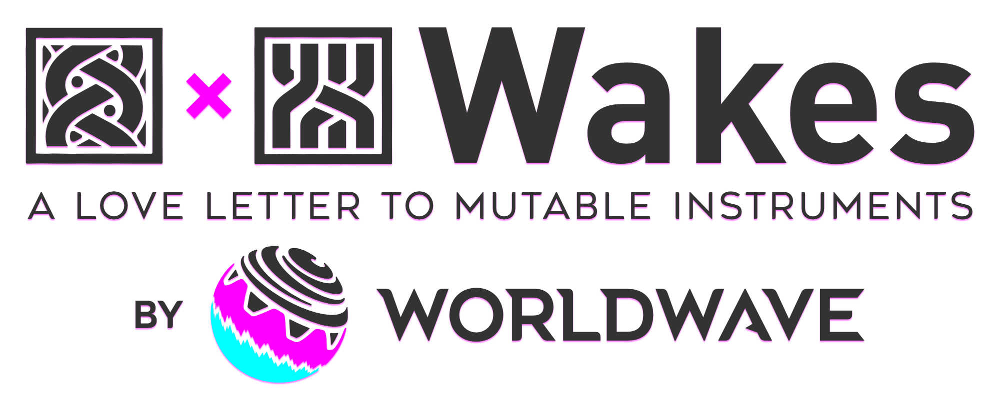

<p align="center">
  
</p>

Wakes is a synthesizer custom firmware for the Teenage Engineering SP-1, Teenage Engineering's unreleased stem player. 
It runs two Mutable Instruments modules combined:

- **Plaits**: A macro-synthesizer voice, featuring multiple sound engines
- **Marbles**: A playful random sequencer

The development of Wakes is unaffiliated with Teenage Engineering or Mutable Instruments.
IMPORTANT: Flashing custom firmware on the SP-1 is at your own risk. SP-1s are abandonware, they do not have manufacturer support.

## 📖 Manual

**[Wakes – Manual (PDF)](docs/Wakes%20-%20Manual.pdf)**: The manual details the layout of each page, with every control and how how to use them, in an aesthetically pleasing and readable format. Once you've installed Wakes on your SP-1, start there.

## Status

**v0.5.0, pre-release for beta testing.** Report problems with the bug form under [Issues](https://github.com/Worldwave/Wakes/issues).

## Flashing

1. **[Download the latest `wakes-sp1.bin`](https://github.com/Worldwave/Wakes/releases/latest/download/wakes-sp1.bin)**.
   Older versions and release notes are on the [releases page](https://github.com/Worldwave/Wakes/releases).
2. Open <https://solderless.engineering>. Hold down **T1+T4** while connecting the SP-1 over USB-C.
3. Select the `.bin` in Solderless Engineering's page, flash it, and once done, you can unplug.

The T1+T4 recovery trigger in step 2 lives in Teenage Engineering's bootloader, not in Wakes, so it
works with whatever firmware is installed. Wakes never writes below `0x20000` (and neither should your CFW's),
because that's where the bootloader lives.

## Building

Zephyr **v4.3.1** and Zephyr SDK **0.17.4**, both pinned. The workspace path must not contain
spaces, and the clone must be named `wakes-sp1`.

```sh
mkdir sp1-ws && cd sp1-ws
git clone https://github.com/Worldwave/Wakes wakes-sp1
west init -l wakes-sp1 && west update
cd zephyr && git apply ../wakes-sp1/zephyr-patches/nordic-cmsis-system-core-clock.patch && cd ..
pip install -r zephyr/scripts/requirements.txt
west build -p always -b stem_player wakes-sp1/firmware -- -DBOARD_ROOT="$PWD/wakes-sp1"
```

Output: `build/zephyr/wakes-sp1.bin`. The Zephyr patch is required and is lost on every
`west update`. Windows setup and troubleshooting: [`docs/BUILD.md`](docs/BUILD.md).

## Reference

| | |
|---|---|
| [`docs/UI-PAGES.md`](docs/UI-PAGES.md) | every control on every page, in detail |
| [`config/engines.csv`](config/engines.csv) | which engine sits in each of the 24 slots (editable) |
| [`docs/PLAITS-ENGINES.md`](docs/PLAITS-ENGINES.md) | every engine, its faders and its CPU cost |
| [`docs/MARBLES-SETTINGS.md`](docs/MARBLES-SETTINGS.md) | Marbles models, ranges and scales |
| [`docs/DEFAULTS.md`](docs/DEFAULTS.md) | every default, and what a reset restores |
| [`docs/MIDI.md`](docs/MIDI.md) | MIDI over USB: what it does, and how to change it |
| [`config/midi.ini`](config/midi.ini) | the MIDI script: channel, legato, CC numbers (editable) |
| [`docs/SAFETY.md`](docs/SAFETY.md) | rules for anyone changing the firmware |

## Licence

MIT, Copyright (c) 2026 Worldwave | Adara Barami. See [`LICENSE`](LICENSE). A few files are
Apache-2.0 instead, because they derive from Zephyr (Apache-2.0); [`NOTICE`](NOTICE) lists them.

Plaits, Marbles and stmlib are by Émilie Gillet (MIT), included unmodified in
`third_party/eurorack/`; the MIDI note handling is ported from her Yarns. The USB-MIDI class
is feldd's (bnjreece/feldd-sp1-firmware, MIT), included unmodified in `third_party/feldd/`.
The board support builds on chattock/sp1-tape-looper, timknapen/SP-1-dev and
ericlewis/sp1-midi (all MIT). Details in [`NOTICE`](NOTICE) and [`LICENSES/`](LICENSES/).
